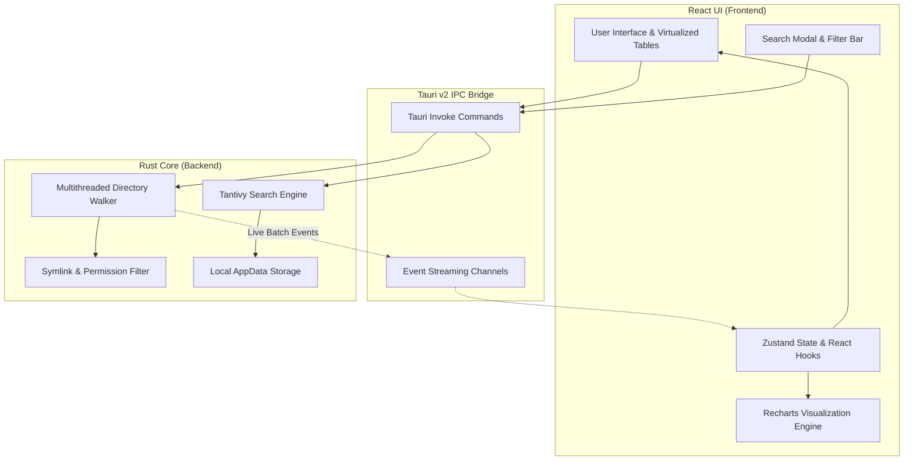

Folder Size Viewer is designed for extreme performance when processing filesystem hierarchies containing millions of nodes.

## High-Level Architecture Diagram

---

## The Scanner Subsystem

### 1. Concurrent Worker Pool
Rather than using single-threaded directory recursion, the scanner leverages a work-stealing thread pool. As new subdirectories are discovered, they are dispatched across available CPU cores.

### 2. Live Batch Event Streaming
If the scanner emitted an IPC event for every individual file, the frontend would drown in event message overhead. Instead, the Rust backend buffers sized items and emits grouped batches every 50 milliseconds via `tauri::Emitter::emit`. This keeps UI responsiveness smooth at 60 FPS while streaming thousands of updates per second.

---

## Tantivy Search Subsystem

- **Schema Definition**:
  - `path`: Text field (stored, indexed as string)
  - `name`: Text field (tokenized with English stemmer + raw sub-tokens)
  - `content`: Text field (indexed, positions recorded for phrase matching, not stored to save disk)
  - `extension`: Facet / keyword string
  - `size`: Unsigned 64-bit integer
  - `modified`: Fast field timestamp
- **Index Writer**: Operates with a dedicated background thread pool. Memory budget is capped at 64 MB per segment during commits.
